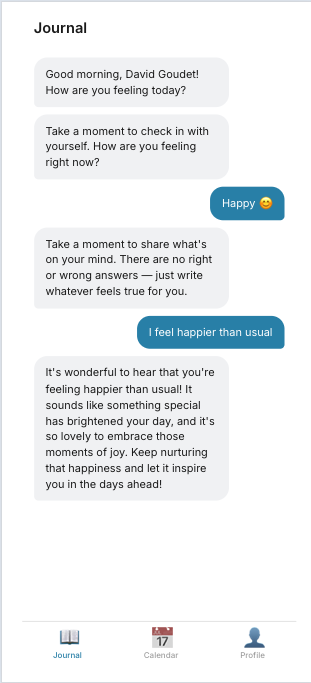
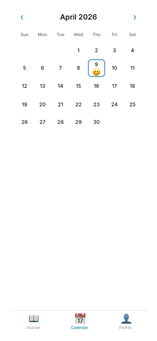
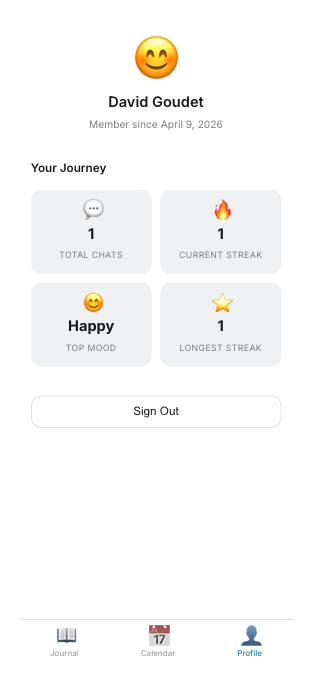
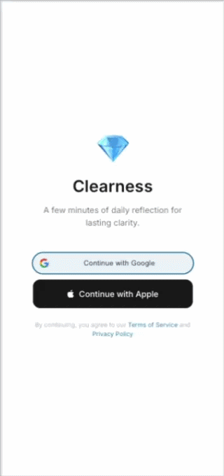

# Clearness

Clearness is a daily journaling app built to help you reflect and track your mood over time. Each day you get one conversation: pick how you're feeling, write your thoughts, and receive an AI-generated  acknowledgment. <br><br>Past entries are saved to a calendar so you can revisit any day and see your mood history at a glance. Authentication is handled via Google or Apple, no passwords required. 


Clearness is a full-stack web application built with Django (REST API) and React (Vite).
  <table>                                                                                                                                                                                                              
    <tr>                                                                                                                                                                                                               
      <td></td>                                                                                                                                                             
      <td></td>
      <td></td>                                                                                                                                                             
    </tr>    
                                                                                                                                                                                             
  </table> 

  <p align="center">                                                                                                                                                                                                   
                                                                                                                                                                             
  </p>                                                                                                                                                                                                                 
       

## Project Structure

```
Clearness/
├── backend/          # Django REST API
│   ├── clearness/    # Django project settings
│   └── api/          # Main API app
├── frontend/         # React app (Vite)
│   └── src/
├── stories/          # Project user stories and specifications
└── .claude/          # Claude Code configuration
```

## Tech Stack

- **Backend:** Python 3.12+, Django 5.x, Django REST Framework, PostgreSQL
- **Frontend:** React 19, Vite, Node 20+
- **API format:** REST (JSON)

## Getting Started

### Quickstart with Docker
  Make sure you filled the .env file with the right credentials.

  ```cp .env.example .env                                                                                                                                                                                               
  docker compose up --build                                                                                                
  ```                                                                                            
                                                                                                                                                                                                                       
  That's it. Once running:                                                                                                                                                                                             
  - Frontend: http://localhost:3000                                                                                                                                                                                    
  - API: http://localhost:3000/api/items/                                                                                                                                                                              
  - Admin: http://localhost:3000/admin/                                                                                                                                                                                
  - Direct API: http://localhost:8000/api/items/
                                                

### Prerequisites

- Python 3.12+
- Node.js 20+
- PostgreSQL


### Backend Setup

```bash
cd backend
python -m venv venv
source venv/bin/activate
pip install -r requirements.txt
python manage.py migrate
python manage.py runserver
```

The API will be available at `http://localhost:8000/api/`.

### OpenAI Configuration

The backend uses OpenAI to generate personalized journal acknowledgments. Add your API key to the `.env` file in the project root:

```bash
cp .env.example .env
```

Then set the following variables in `.env`:

```
OPENAI_API_KEY=sk-your-openai-api-key
OPENAI_MODEL=gpt-4o-mini          # optional, defaults to gpt-4o-mini
```

You can get an API key from [platform.openai.com/api-keys](https://platform.openai.com/api-keys). If no key is configured, the app will fall back to a generic acknowledgment message.

### Frontend Setup

```bash
cd frontend
npm install
npm run dev
```

The app will be available at `http://localhost:5173`. API requests to `/api/*` are proxied to Django during development.

## Testing

### Backend Tests

```bash
cd backend
source venv/bin/activate
python manage.py test           # Run all tests
python manage.py test api       # Run tests for a specific app
```

### Frontend Linting

```bash
cd frontend
npm run lint                     # Run ESLint
```

## Development

- Backend API runs on port **8000**
- Frontend dev server runs on port **5173** with proxy to backend
- `django-cors-headers` handles CORS for production deployments
