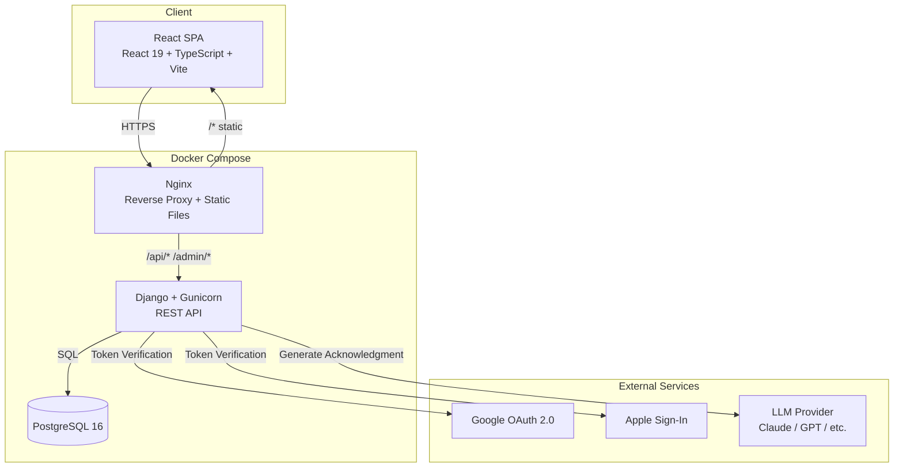
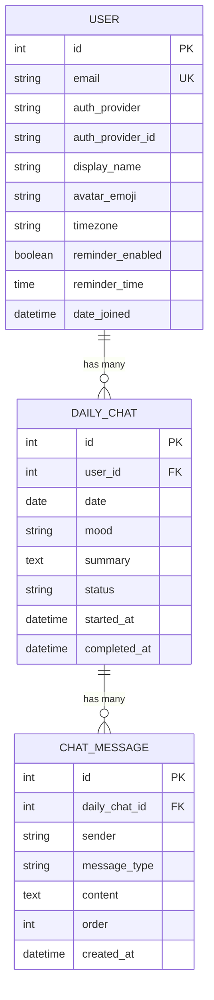
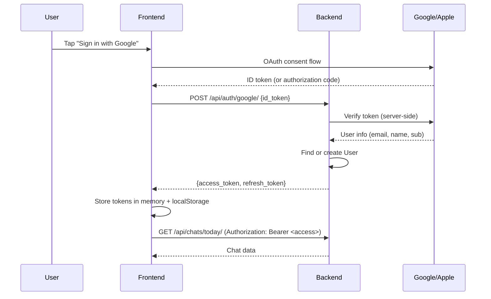
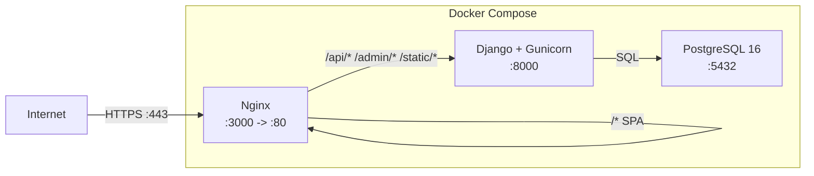

# Clearness -- Architecture Document

**Version:** 1.1
**Date:** March 2, 2026
**Status:** Approved for MVP Development
**Author:** System Architect (with Claude assistance)

---

## Table of Contents

1. [System Overview](#1-system-overview)
2. [Backend Architecture](#2-backend-architecture)
3. [Frontend Architecture](#3-frontend-architecture)
4. [API Contract](#4-api-contract)
5. [Deployment Architecture](#5-deployment-architecture)
6. [Non-Functional Requirements](#6-non-functional-requirements)
7. [Future Considerations](#7-future-considerations)
8. [Architecture Decision Records](#8-architecture-decision-records)

---

## 1. System Overview

### 1.1 High-Level Architecture



### 1.2 Component Overview

| Component | Technology | Responsibility |
|-----------|-----------|---------------|
| Frontend SPA | React 19, TypeScript, Vite | User interface, routing, state management |
| Reverse Proxy | Nginx | TLS termination, static file serving, API proxying |
| API Server | Django 5.x, DRF, Gunicorn | Business logic, authentication, data access |
| Database | PostgreSQL 16 | Persistent data storage |
| OAuth Providers | Google, Apple | Third-party authentication |
| LLM Provider | Claude, GPT, or other (pluggable) | Generate empathetic acknowledgment responses |

### 1.3 Technology Stack Justification

The Django + React stack is appropriate for Clearness because:

- **Django + DRF** provides a batteries-included framework with built-in ORM, admin panel, migrations, and authentication scaffolding. For a data-driven CRUD application with structured chat flows (not real-time WebSocket chat), this is the right level of framework. The admin panel alone saves weeks of building internal tools.
- **PostgreSQL** is the default database for Django and handles the relational data model (users, daily chats, moods) cleanly. At 5,000 DAU with one chat per user per day, we are talking about roughly 5,000 new rows per day -- PostgreSQL handles this without breaking a sweat.
- **React + TypeScript** provides strong typing for the structured data we pass around (chat messages, mood enums, calendar data) and a large ecosystem for UI components.
- **Vite** gives fast development feedback loops and optimized production builds.
- **Docker Compose** keeps the deployment simple: one command to spin up the entire stack. No Kubernetes needed at this scale.

**LLM Integration:**
- The acknowledgment response (the final bot message after the user submits their reflection) is generated by an external LLM provider. The integration is **provider-agnostic**: an abstract interface in `services/llm.py` allows swapping between Claude (Anthropic), GPT (OpenAI), or any other provider via configuration. Greeting and mood follow-up messages remain templated for cost efficiency and predictability.
- A templated fallback is always available: if the LLM call fails or times out, the user still gets a meaningful response.

What we deliberately avoided:
- **No WebSocket/real-time layer.** The chat is a structured flow, not a real-time conversation. Standard REST request-response is sufficient. The typing indicator is a frontend-only animation.
- **No separate microservices.** A single Django process handles everything. At 5,000 DAU this is appropriate.
- **No Redis/Celery.** The LLM call is synchronous within the request-response cycle. At MVP scale (~5,000 calls/day), this is fine. Push notifications are deferred.

---

## 2. Backend Architecture

### 2.1 Django Project Structure

We keep the existing single `api` app and do not split into multiple apps for the MVP. The domain is small: users have daily chats with moods. Splitting into `accounts`, `journal`, and `calendar` apps would create unnecessary coupling overhead (cross-app imports, circular dependencies) for a team that is building a focused MVP.

```
backend/
  clearness/                # Django project configuration
    __init__.py
    settings.py             # Main settings (import from base/dev/prod as needed)
    urls.py
    wsgi.py
    asgi.py
  api/                      # Single app for all MVP functionality
    __init__.py
    models.py               # User, DailyChat models
    serializers.py           # DRF serializers
    views.py                 # DRF viewsets and API views
    urls.py                  # URL routing
    admin.py                 # Admin site configuration
    permissions.py           # Custom DRF permissions
    authentication.py        # OAuth token verification logic
    services.py              # Business logic (chat flow, stats calculation)
    llm.py                   # LLM provider abstraction (acknowledgment generation)
    tests/
      __init__.py
      test_models.py
      test_views.py
      test_services.py
    migrations/
  manage.py
  requirements.txt
  entrypoint.sh
  Dockerfile
```

The `services.py` module keeps business logic out of views and models. Views handle HTTP concerns; services handle domain logic (e.g., "create today's chat", "calculate streak", "generate greeting").

### 2.2 Data Model Design

#### 2.2.1 User Model

We extend Django's `AbstractUser` to add Clearness-specific fields directly on the user model. This is simpler than a separate Profile model and avoids the extra JOIN on every request.

```python
# api/models.py

from django.contrib.auth.models import AbstractUser
from django.db import models


class User(AbstractUser):
    """
    Custom user model for Clearness.
    Uses OAuth exclusively -- no password-based auth for MVP.
    """

    # Override username to make it optional (we use OAuth)
    username = models.CharField(max_length=150, blank=True, default="")

    # OAuth fields
    AUTH_PROVIDER_CHOICES = [
        ("google", "Google"),
        ("apple", "Apple"),
    ]
    auth_provider = models.CharField(
        max_length=10,
        choices=AUTH_PROVIDER_CHOICES,
    )
    auth_provider_id = models.CharField(
        max_length=255,
        help_text="Provider-specific user ID (Google sub, Apple sub)",
    )

    # Profile fields
    display_name = models.CharField(max_length=100)
    avatar_emoji = models.CharField(max_length=10, default="😊")
    timezone = models.CharField(
        max_length=63,
        default="UTC",
        help_text="IANA timezone string, e.g. 'America/New_York'",
    )

    # Settings
    reminder_enabled = models.BooleanField(default=True)
    reminder_time = models.TimeField(
        default="20:00",
        help_text="Local time for daily reminder",
    )

    USERNAME_FIELD = "email"
    REQUIRED_FIELDS = ["display_name"]

    class Meta:
        constraints = [
            models.UniqueConstraint(
                fields=["auth_provider", "auth_provider_id"],
                name="unique_provider_account",
            ),
        ]

    def __str__(self):
        return self.display_name
```

Important: Set `AUTH_USER_MODEL = "api.User"` in `settings.py` before running the first migration.

#### 2.2.2 DailyChat Model

The `DailyChat` is the parent container for a day's conversation. It holds the mood, status, and a **summary** field used by the calendar view. Individual messages are stored in the `ChatMessage` child model (see 2.2.3).

```python
class DailyChat(models.Model):
    """
    One chat session per user per day.
    Acts as the parent container; individual messages live in ChatMessage.
    """

    class MoodChoice(models.TextChoices):
        HAPPY = "happy", "Happy"
        CALM = "calm", "Calm"
        NEUTRAL = "neutral", "Neutral"
        DOWN = "down", "Down"
        FRUSTRATED = "frustrated", "Frustrated"

    class StatusChoice(models.TextChoices):
        IN_PROGRESS = "in_progress", "In Progress"
        COMPLETED = "completed", "Completed"

    user = models.ForeignKey(
        "User",
        on_delete=models.CASCADE,
        related_name="daily_chats",
    )
    date = models.DateField(
        help_text="The calendar date of this chat in the user's local timezone",
    )

    # Mood (selected once during the chat flow)
    mood = models.CharField(
        max_length=20,
        choices=MoodChoice.choices,
        blank=True,
    )

    # Summary for calendar view — a short reflection of the day's conversation
    summary = models.TextField(
        blank=True,
        help_text="Brief summary of the day's reflection, shown in calendar daily view",
    )

    # Metadata
    status = models.CharField(
        max_length=20,
        choices=StatusChoice.choices,
        default=StatusChoice.IN_PROGRESS,
    )
    started_at = models.DateTimeField(auto_now_add=True)
    completed_at = models.DateTimeField(null=True, blank=True)

    class Meta:
        constraints = [
            models.UniqueConstraint(
                fields=["user", "date"],
                name="one_chat_per_user_per_day",
            ),
        ]
        ordering = ["-date"]

    def __str__(self):
        return f"{self.user.display_name} - {self.date} ({self.status})"
```

#### 2.2.3 ChatMessage Model

Each message in the conversation is stored as a separate row. This supports the structured MVP flow (greeting, mood prompt, user response, acknowledgment) and scales naturally to open-ended conversations in the future.

```python
class ChatMessage(models.Model):
    """
    A single message within a daily chat.
    Messages are ordered by their position in the conversation.
    """

    class SenderChoice(models.TextChoices):
        BOT = "bot", "Bot"
        USER = "user", "User"

    class MessageType(models.TextChoices):
        TEXT = "text", "Text"
        GREETING = "greeting", "Greeting"
        MOOD_PROMPT = "mood_prompt", "Mood Prompt"
        MOOD_SELECTION = "mood_selection", "Mood Selection"
        REFLECTION = "reflection", "Reflection"
        ACKNOWLEDGMENT = "acknowledgment", "Acknowledgment"

    daily_chat = models.ForeignKey(
        "DailyChat",
        on_delete=models.CASCADE,
        related_name="messages",
    )
    sender = models.CharField(
        max_length=10,
        choices=SenderChoice.choices,
    )
    message_type = models.CharField(
        max_length=20,
        choices=MessageType.choices,
        default=MessageType.TEXT,
    )
    content = models.TextField(
        help_text="The message text content",
    )
    order = models.PositiveIntegerField(
        help_text="Position in the conversation (0-indexed)",
    )
    created_at = models.DateTimeField(auto_now_add=True)

    class Meta:
        ordering = ["order"]
        constraints = [
            models.UniqueConstraint(
                fields=["daily_chat", "order"],
                name="unique_message_order_per_chat",
            ),
        ]

    def __str__(self):
        return f"[{self.sender}] {self.content[:50]}"
```

**MVP chat flow as messages:**

| Order | Sender | Type | Source | Content example |
|-------|--------|------|--------|----------------|
| 0 | bot | greeting | Templated | "Good evening, David! How are you feeling today?" |
| 1 | bot | mood_prompt | Templated | "Pick the emoji that best matches your mood:" |
| 2 | user | mood_selection | User input | "calm" |
| 3 | bot | text | Templated | "Thanks for sharing. What's on your mind today?" |
| 4 | user | reflection | User input | "Had a productive day at work..." |
| 5 | bot | acknowledgment | **LLM-generated** | "It sounds like you had a fulfilling day..." |

The acknowledgment (order 5) is generated by the configured LLM provider (see Section 2.6). All other bot messages are templated. This design means future features (follow-up questions, open-ended conversation, full LLM-powered responses) only add more rows — no schema changes needed.

#### 2.2.4 Entity-Relationship Diagram



#### 2.2.4 Timezone Handling Strategy

The user stores their IANA timezone (e.g., `America/New_York`) on their profile. The server always stores and processes datetimes in UTC (`USE_TZ = True` in Django settings). The "date" field on `DailyChat` represents the calendar date in the user's local timezone.

When determining "today's chat":
1. The frontend sends the user's local date (YYYY-MM-DD) in the request.
2. The backend validates that this date is reasonable given the user's stored timezone (guard against manipulation).
3. The unique constraint `(user, date)` enforces one chat per calendar day.

This approach avoids complex server-side timezone conversions. The frontend knows what day it is for the user; the backend trusts it within bounds.

### 2.3 API Design

All endpoints live under `/api/` and require authentication unless noted otherwise.

#### 2.3.1 Endpoint Overview

| Method | Endpoint | Auth | Description |
|--------|----------|------|-------------|
| POST | `/api/auth/google/` | No | Exchange Google OAuth token for JWT |
| POST | `/api/auth/apple/` | No | Exchange Apple Sign-In token for JWT |
| POST | `/api/auth/refresh/` | No | Refresh JWT access token |
| GET | `/api/me/` | Yes | Get current user profile |
| PATCH | `/api/me/` | Yes | Update profile (name, avatar, timezone, settings) |
| DELETE | `/api/me/` | Yes | Delete account and all data (GDPR) |
| GET | `/api/chats/today/` | Yes | Get or create today's chat |
| PATCH | `/api/chats/today/` | Yes | Update today's chat (mood, response) |
| GET | `/api/chats/{date}/` | Yes | Get chat for a specific date (read-only) |
| GET | `/api/chats/calendar/?month=2026-03` | Yes | Get mood data for a calendar month |
| GET | `/api/stats/` | Yes | Get journey statistics |

#### 2.3.2 View Organization

```python
# api/views.py

from rest_framework import status
from rest_framework.decorators import api_view, permission_classes
from rest_framework.permissions import AllowAny, IsAuthenticated
from rest_framework.response import Response
from rest_framework.views import APIView


class GoogleAuthView(APIView):
    """Exchange Google OAuth token for JWT pair."""
    permission_classes = [AllowAny]

    def post(self, request):
        # Verify Google token, find-or-create user, return JWT
        ...


class AppleAuthView(APIView):
    """Exchange Apple Sign-In token for JWT pair."""
    permission_classes = [AllowAny]

    def post(self, request):
        # Verify Apple token, find-or-create user, return JWT
        ...


class ProfileView(APIView):
    """GET/PATCH/DELETE current user profile."""
    permission_classes = [IsAuthenticated]

    def get(self, request):
        ...

    def patch(self, request):
        ...

    def delete(self, request):
        # Hard delete user and all related data
        ...


class TodayChatView(APIView):
    """GET: return today's chat (create if needed). PATCH: update chat."""
    permission_classes = [IsAuthenticated]

    def get(self, request):
        ...

    def patch(self, request):
        ...


class ChatDetailView(APIView):
    """GET a specific past chat by date (read-only)."""
    permission_classes = [IsAuthenticated]

    def get(self, request, date):
        ...


class CalendarView(APIView):
    """GET mood data for a given month."""
    permission_classes = [IsAuthenticated]

    def get(self, request):
        ...


class StatsView(APIView):
    """GET journey statistics for the current user."""
    permission_classes = [IsAuthenticated]

    def get(self, request):
        ...
```

We use `APIView` rather than `ModelViewSet` because the endpoints do not map neatly to standard CRUD operations. `today/` is a singleton-by-date pattern; `calendar/` is an aggregation. Explicit views are clearer here.

#### 2.3.3 URL Configuration

```python
# api/urls.py

from django.urls import path
from rest_framework_simplejwt.views import TokenRefreshView

from .views import (
    AppleAuthView,
    CalendarView,
    ChatDetailView,
    GoogleAuthView,
    ProfileView,
    StatsView,
    TodayChatView,
)

urlpatterns = [
    # Authentication
    path("auth/google/", GoogleAuthView.as_view(), name="auth-google"),
    path("auth/apple/", AppleAuthView.as_view(), name="auth-apple"),
    path("auth/refresh/", TokenRefreshView.as_view(), name="auth-refresh"),

    # Profile
    path("me/", ProfileView.as_view(), name="profile"),

    # Journal
    path("chats/today/", TodayChatView.as_view(), name="chat-today"),
    path("chats/calendar/", CalendarView.as_view(), name="chat-calendar"),
    path("chats/<str:date>/", ChatDetailView.as_view(), name="chat-detail"),

    # Stats
    path("stats/", StatsView.as_view(), name="stats"),
]
```

### 2.4 Authentication Architecture

#### 2.4.1 JWT-Based Authentication

We use JWT (via `djangorestframework-simplejwt`) instead of Django session-based authentication. See ADR-001 for full rationale.

**Flow:**



**Token Configuration:**

```python
# settings.py

from datetime import timedelta

SIMPLE_JWT = {
    "ACCESS_TOKEN_LIFETIME": timedelta(minutes=30),
    "REFRESH_TOKEN_LIFETIME": timedelta(days=7),
    "ROTATE_REFRESH_TOKENS": True,
    "BLACKLIST_AFTER_ROTATION": True,
    "AUTH_HEADER_TYPES": ("Bearer",),
}

REST_FRAMEWORK = {
    "DEFAULT_AUTHENTICATION_CLASSES": [
        "rest_framework_simplejwt.authentication.JWTAuthentication",
    ],
    "DEFAULT_PERMISSION_CLASSES": [
        "rest_framework.permissions.IsAuthenticated",
    ],
}
```

#### 2.4.2 Google OAuth Server-Side Verification

Use the `google-auth` library to verify the ID token server-side. Do not trust the token payload from the client without verification.

```python
# api/authentication.py

from google.oauth2 import id_token
from google.auth.transport import requests as google_requests


def verify_google_token(token: str) -> dict:
    """
    Verify Google ID token and return user info.
    Raises ValueError if token is invalid.
    """
    idinfo = id_token.verify_oauth2_token(
        token,
        google_requests.Request(),
        audience=settings.GOOGLE_CLIENT_ID,
    )
    return {
        "email": idinfo["email"],
        "name": idinfo.get("name", ""),
        "provider_id": idinfo["sub"],
    }
```

#### 2.4.3 Apple Sign-In Verification

Apple Sign-In uses a JWT (identity token) signed by Apple. Verify it using Apple's public keys.

```python
# api/authentication.py

import jwt
import requests


APPLE_PUBLIC_KEYS_URL = "https://appleid.apple.com/auth/keys"


def verify_apple_token(identity_token: str) -> dict:
    """
    Verify Apple identity token using Apple's public keys.
    Raises ValueError if token is invalid.
    """
    # Fetch Apple's public keys
    apple_keys = requests.get(APPLE_PUBLIC_KEYS_URL).json()["keys"]

    # Decode header to find the right key
    header = jwt.get_unverified_header(identity_token)
    key = next(k for k in apple_keys if k["kid"] == header["kid"])

    public_key = jwt.algorithms.RSAAlgorithm.from_jwk(key)
    payload = jwt.decode(
        identity_token,
        public_key,
        algorithms=["RS256"],
        audience=settings.APPLE_CLIENT_ID,
        issuer="https://appleid.apple.com",
    )
    return {
        "email": payload.get("email", ""),
        "name": "",  # Apple only sends name on first auth
        "provider_id": payload["sub"],
    }
```

#### 2.4.4 Required Libraries

Add to `requirements.txt`:

```
djangorestframework-simplejwt>=5.3,<6.0
google-auth>=2.29,<3.0
PyJWT[crypto]>=2.8,<3.0
requests>=2.31,<3.0
```

#### 2.4.5 Token Storage (Frontend)

- **Access token:** Stored in a module-level variable (in-memory). Lost on page refresh, but that is fine -- refresh token recovers it.
- **Refresh token:** Stored in `localStorage`. This is an acceptable trade-off for an MVP. The refresh token has a 7-day lifetime and rotates on use.
- **On app load:** If a refresh token exists in `localStorage`, attempt a silent refresh to get a new access token. If it fails, redirect to the login screen.

### 2.5 Security

#### 2.5.1 CORS Configuration

Already present in the project. For production, restrict to the exact frontend origin:

```python
# settings.py
CORS_ALLOWED_ORIGINS = os.environ.get(
    "CORS_ALLOWED_ORIGINS",
    "http://localhost:5173,http://127.0.0.1:5173",
).split(",")
```

#### 2.5.2 CSRF Handling

Since we use JWT Bearer tokens (not cookies), CSRF protection is not needed for API endpoints. Django's CSRF middleware will not interfere with requests that use `Authorization: Bearer` headers. The admin panel continues to use CSRF as normal.

#### 2.5.3 Input Validation

- All input passes through DRF serializers with explicit field definitions and validators.
- Mood values are validated against the `MoodChoice` enum.
- Date fields are validated for format and reasonable range.
- Message `content` fields have a `max_length` on the serializer (2000 characters for MVP) to prevent abuse.

#### 2.5.4 Rate Limiting

Add `django-ratelimit` or use DRF's built-in throttling:

```python
# settings.py
REST_FRAMEWORK = {
    ...
    "DEFAULT_THROTTLE_CLASSES": [
        "rest_framework.throttling.UserRateThrottle",
        "rest_framework.throttling.AnonRateThrottle",
    ],
    "DEFAULT_THROTTLE_RATES": {
        "user": "100/hour",
        "anon": "20/hour",
    },
}
```

Auth endpoints should have stricter limits (e.g., 10/hour for anonymous) to prevent brute-force token exchange attempts.

#### 2.5.5 Data Encryption at Rest

For MVP, rely on PostgreSQL's native encryption capabilities:
- Use encrypted volumes for the PostgreSQL Docker volume in production.
- Enable TLS for the database connection in production (`sslmode=require` in the database settings).
- Full E2E encryption of journal content is deferred to post-MVP (see Section 7).

#### 2.5.6 Additional Security Headers

Configure via Django settings and nginx:

```python
# settings.py
SECURE_BROWSER_XSS_FILTER = True
SECURE_CONTENT_TYPE_NOSNIFF = True
X_FRAME_OPTIONS = "DENY"
# In production:
# SECURE_SSL_REDIRECT = True
# SECURE_HSTS_SECONDS = 31536000
# SESSION_COOKIE_SECURE = True
```

### 2.6 LLM Integration

#### 2.6.1 Overview

The acknowledgment message — the final bot response after the user submits their reflection — is generated by an external LLM. This is the most impactful message in the chat flow: it should feel empathetic, personalized, and reflective of what the user shared. Templated responses cannot deliver that quality.

All other bot messages (greeting, mood prompt, follow-up after mood selection) remain **templated**. They are short, predictable, and do not benefit meaningfully from LLM generation. This keeps API costs low (~1 LLM call per user per day).

#### 2.6.2 Provider-Agnostic Architecture

The LLM integration uses an abstract interface so the provider can be swapped via configuration without code changes.

```python
# api/llm.py

import logging
from abc import ABC, abstractmethod
from django.conf import settings

logger = logging.getLogger(__name__)


class LLMProvider(ABC):
    """Abstract interface for LLM providers."""

    @abstractmethod
    def generate_acknowledgment(
        self,
        user_name: str,
        mood: str,
        reflection: str,
    ) -> str:
        """
        Generate an empathetic acknowledgment response.

        Args:
            user_name: The user's display name for personalization.
            mood: The mood the user selected (e.g., "calm", "frustrated").
            reflection: The user's free-text reflection.

        Returns:
            A short (1-3 sentence) empathetic response.
        """
        ...


class AnthropicProvider(LLMProvider):
    """Claude via the Anthropic API."""

    def __init__(self):
        import anthropic
        self.client = anthropic.Anthropic(api_key=settings.LLM_API_KEY)
        self.model = settings.LLM_MODEL  # e.g., "claude-sonnet-4-20250514"

    def generate_acknowledgment(self, user_name: str, mood: str, reflection: str) -> str:
        response = self.client.messages.create(
            model=self.model,
            max_tokens=256,
            system=SYSTEM_PROMPT,
            messages=[
                {
                    "role": "user",
                    "content": ACKNOWLEDGMENT_USER_PROMPT.format(
                        user_name=user_name,
                        mood=mood,
                        reflection=reflection,
                    ),
                }
            ],
        )
        return response.content[0].text


class OpenAIProvider(LLMProvider):
    """GPT via the OpenAI API."""

    def __init__(self):
        from openai import OpenAI
        self.client = OpenAI(api_key=settings.LLM_API_KEY)
        self.model = settings.LLM_MODEL  # e.g., "gpt-4o-mini"

    def generate_acknowledgment(self, user_name: str, mood: str, reflection: str) -> str:
        response = self.client.chat.completions.create(
            model=self.model,
            max_tokens=256,
            messages=[
                {"role": "system", "content": SYSTEM_PROMPT},
                {
                    "role": "user",
                    "content": ACKNOWLEDGMENT_USER_PROMPT.format(
                        user_name=user_name,
                        mood=mood,
                        reflection=reflection,
                    ),
                },
            ],
        )
        return response.choices[0].message.content


# --- Prompt templates ---

SYSTEM_PROMPT = (
    "You are Clearness, a warm and empathetic journaling companion. "
    "Your role is to acknowledge the user's daily reflection with kindness and encouragement. "
    "Keep your response to 1-3 sentences. Be genuine, not generic. "
    "Never give medical or therapeutic advice. "
    "Never ask follow-up questions — this is the closing message of the conversation."
)

ACKNOWLEDGMENT_USER_PROMPT = (
    "The user {user_name} selected the mood '{mood}' and shared this reflection:\n\n"
    "\"{reflection}\"\n\n"
    "Write a brief, empathetic acknowledgment."
)


# --- Provider registry ---

_PROVIDERS = {
    "anthropic": AnthropicProvider,
    "openai": OpenAIProvider,
}

_provider_instance: LLMProvider | None = None


def get_llm_provider() -> LLMProvider:
    """Return the configured LLM provider (singleton)."""
    global _provider_instance
    if _provider_instance is None:
        provider_name = settings.LLM_PROVIDER
        if provider_name not in _PROVIDERS:
            raise ValueError(
                f"Unknown LLM provider: {provider_name}. "
                f"Available: {list(_PROVIDERS.keys())}"
            )
        _provider_instance = _PROVIDERS[provider_name]()
    return _provider_instance
```

#### 2.6.3 Fallback Strategy

If the LLM call fails (network error, timeout, rate limit, invalid response), the system falls back to a **templated acknowledgment** so the user always receives a response. The fallback is logged for monitoring.

```python
# In api/services.py

from .llm import get_llm_provider

FALLBACK_ACKNOWLEDGMENTS = {
    "happy": "It's wonderful to hear you're feeling happy. Hold on to that feeling!",
    "calm": "It sounds like you found some peace today. That's something to cherish.",
    "neutral": "Thanks for taking the time to reflect. Every day is worth noting.",
    "down": "I appreciate you sharing that. Tomorrow is a new day, and I'm here for you.",
    "frustrated": "That sounds tough. It takes strength to express how you feel. Hang in there.",
}


def generate_acknowledgment(user_name: str, mood: str, reflection: str) -> str:
    """Generate an acknowledgment, with fallback to templates."""
    try:
        provider = get_llm_provider()
        return provider.generate_acknowledgment(user_name, mood, reflection)
    except Exception:
        logger.warning(
            "LLM acknowledgment generation failed, using fallback",
            exc_info=True,
        )
        return FALLBACK_ACKNOWLEDGMENTS.get(
            mood,
            "Thank you for sharing your thoughts today.",
        )
```

#### 2.6.4 Configuration

```python
# settings.py

# LLM Configuration
LLM_PROVIDER = os.environ.get("LLM_PROVIDER", "anthropic")  # "anthropic" or "openai"
LLM_API_KEY = os.environ.get("LLM_API_KEY", "")
LLM_MODEL = os.environ.get("LLM_MODEL", "claude-sonnet-4-20250514")
LLM_TIMEOUT = int(os.environ.get("LLM_TIMEOUT", "10"))  # seconds
```

#### 2.6.5 Prompt Guardrails

The system prompt enforces these constraints:
- **Tone:** Warm, empathetic, encouraging. Never clinical or robotic.
- **Length:** 1-3 sentences. The acknowledgment should feel like a gentle closing, not a lecture.
- **No advice:** Never give medical, therapeutic, or prescriptive advice. The app is a journal, not a therapist.
- **No follow-up questions:** This is the final message in the conversation flow. Asking questions would confuse the UI.
- **Personalization:** The user's name, mood, and reflection text are injected into the prompt so the response feels specific to what they shared.

#### 2.6.6 Cost Estimation

At 5,000 DAU with one LLM call per user per day:
- **Input:** ~150 tokens (system prompt + user prompt with reflection)
- **Output:** ~60 tokens (1-3 sentence response)
- **Daily volume:** ~5,000 calls
- **Monthly cost estimate (approximate):**
  - Claude Haiku/Sonnet: $2-15/month
  - GPT-4o-mini: $2-5/month

This is negligible. The provider-agnostic design allows switching to a cheaper model if costs grow with scale.

---

## 3. Frontend Architecture

### 3.1 Project Structure

```
frontend/src/
  main.tsx                     # Entry point, router setup
  App.tsx                      # Root component, auth provider
  types/
    api.ts                     # API response/request types
    chat.ts                    # Chat-related types and enums
  services/
    api.ts                     # HTTP client wrapper (fetch + auth headers)
    auth.ts                    # Token storage, refresh logic, OAuth flows
    chat.ts                    # Chat API calls
    calendar.ts                # Calendar API calls
    profile.ts                 # Profile/stats API calls
  hooks/
    useAuth.ts                 # Authentication state and actions
    useChat.ts                 # Today's chat state management
    useCalendar.ts             # Calendar month data
    useStats.ts                # Profile stats
  pages/
    LoginPage.tsx              # OAuth sign-in buttons
    JournalPage.tsx            # Daily chat view
    CalendarPage.tsx           # Monthly mood calendar
    ProfilePage.tsx            # Profile and settings
  components/
    layout/
      BottomNav.tsx            # Tab navigation bar
      ProtectedRoute.tsx       # Auth guard wrapper
    chat/
      ChatMessageList.tsx      # Scrollable message container
      ChatBubble.tsx           # Single message bubble (bot or user)
      TypingIndicator.tsx      # Pulsing dots animation
      MoodSelector.tsx         # Emoji mood picker
      ChatInput.tsx            # Text input bar with send button
    calendar/
      CalendarGrid.tsx         # Monthly grid layout
      CalendarDay.tsx          # Single day cell with mood emoji
      DailySummary.tsx         # Detail view for a selected day
    profile/
      StatsGrid.tsx            # 2x2 stats cards
      SettingsSection.tsx      # Settings toggles
  styles/
    variables.css              # Design tokens (colors, spacing, radii)
    global.css                 # Base styles, typography
```

### 3.2 State Management

Use React Context for authentication state and standard hooks (`useState`, `useEffect`) with custom hooks for data fetching. No external state management library is needed for the MVP.

**Rationale:** The application state is simple and page-scoped. The journal page manages today's chat. The calendar page fetches a month of data. The profile page fetches stats. There is no shared mutable state between pages that would require a global store.

```typescript
// hooks/useAuth.ts

import {
  createContext,
  useContext,
  useState,
  useEffect,
  useCallback,
  type ReactNode,
} from "react";
import { refreshAccessToken, clearTokens } from "../services/auth";
import type { User } from "../types/api";

interface AuthState {
  user: User | null;
  isLoading: boolean;
  isAuthenticated: boolean;
  login: (provider: "google" | "apple", token: string) => Promise<void>;
  logout: () => void;
}

const AuthContext = createContext<AuthState | null>(null);

export function AuthProvider({ children }: { children: ReactNode }) {
  const [user, setUser] = useState<User | null>(null);
  const [isLoading, setIsLoading] = useState(true);

  useEffect(() => {
    // On mount, try to refresh token silently
    refreshAccessToken()
      .then((userData) => setUser(userData))
      .catch(() => clearTokens())
      .finally(() => setIsLoading(false));
  }, []);

  const login = useCallback(
    async (provider: "google" | "apple", token: string) => {
      // Call backend auth endpoint, store tokens, fetch user
      ...
    },
    []
  );

  const logout = useCallback(() => {
    clearTokens();
    setUser(null);
  }, []);

  return (
    <AuthContext.Provider
      value={{
        user,
        isLoading,
        isAuthenticated: user !== null,
        login,
        logout,
      }}
    >
      {children}
    </AuthContext.Provider>
  );
}

export function useAuth(): AuthState {
  const context = useContext(AuthContext);
  if (!context) {
    throw new Error("useAuth must be used within AuthProvider");
  }
  return context;
}
```

### 3.3 Routing

Use React Router v7 with a simple flat route structure matching the three-tab navigation.

```typescript
// main.tsx

import { BrowserRouter, Routes, Route, Navigate } from "react-router-dom";
import { AuthProvider } from "./hooks/useAuth";
import ProtectedRoute from "./components/layout/ProtectedRoute";
import LoginPage from "./pages/LoginPage";
import JournalPage from "./pages/JournalPage";
import CalendarPage from "./pages/CalendarPage";
import ProfilePage from "./pages/ProfilePage";
import BottomNav from "./components/layout/BottomNav";

function App() {
  return (
    <AuthProvider>
      <BrowserRouter>
        <Routes>
          <Route path="/login" element={<LoginPage />} />
          <Route element={<ProtectedRoute />}>
            <Route path="/journal" element={<JournalPage />} />
            <Route path="/calendar" element={<CalendarPage />} />
            <Route path="/profile" element={<ProfilePage />} />
            <Route path="*" element={<Navigate to="/journal" replace />} />
          </Route>
        </Routes>
      </BrowserRouter>
    </AuthProvider>
  );
}
```

The `ProtectedRoute` component checks `useAuth().isAuthenticated` and redirects to `/login` if not authenticated. It renders an `<Outlet />` wrapped with `<BottomNav />` for the authenticated layout.

```typescript
// components/layout/ProtectedRoute.tsx

import { Navigate, Outlet } from "react-router-dom";
import { useAuth } from "../../hooks/useAuth";
import BottomNav from "./BottomNav";

export default function ProtectedRoute() {
  const { isAuthenticated, isLoading } = useAuth();

  if (isLoading) {
    return <div className="loading-screen">Loading...</div>;
  }

  if (!isAuthenticated) {
    return <Navigate to="/login" replace />;
  }

  return (
    <div className="app-layout">
      <main className="app-content">
        <Outlet />
      </main>
      <BottomNav />
    </div>
  );
}
```

### 3.4 API Integration

#### 3.4.1 HTTP Client

Use the native `fetch` API with a thin wrapper that handles authentication headers and token refresh. No need for axios -- `fetch` is built-in and sufficient.

```typescript
// services/api.ts

const API_BASE = "/api";

let accessToken: string | null = null;

export function setAccessToken(token: string | null) {
  accessToken = token;
}

export function getAccessToken(): string | null {
  return accessToken;
}

export async function apiRequest<T>(
  path: string,
  options: RequestInit = {}
): Promise<T> {
  const headers: Record<string, string> = {
    "Content-Type": "application/json",
    ...(options.headers as Record<string, string>),
  };

  if (accessToken) {
    headers["Authorization"] = `Bearer ${accessToken}`;
  }

  let response = await fetch(`${API_BASE}${path}`, {
    ...options,
    headers,
  });

  // If 401, attempt token refresh and retry once
  if (response.status === 401 && accessToken) {
    const refreshed = await attemptTokenRefresh();
    if (refreshed) {
      headers["Authorization"] = `Bearer ${accessToken}`;
      response = await fetch(`${API_BASE}${path}`, {
        ...options,
        headers,
      });
    }
  }

  if (!response.ok) {
    const error = await response.json().catch(() => ({}));
    throw new ApiError(response.status, error);
  }

  // Handle 204 No Content
  if (response.status === 204) {
    return undefined as T;
  }

  return response.json();
}

class ApiError extends Error {
  constructor(
    public status: number,
    public data: Record<string, unknown>
  ) {
    super(`API error: ${status}`);
  }
}
```

#### 3.4.2 Service Layer Example

```typescript
// services/chat.ts

import { apiRequest } from "./api";
import type { DailyChat, ChatUpdate } from "../types/api";

export function getTodayChat(localDate: string): Promise<DailyChat> {
  return apiRequest<DailyChat>(`/chats/today/?date=${localDate}`);
}

export function updateTodayChat(
  localDate: string,
  data: ChatUpdate
): Promise<DailyChat> {
  return apiRequest<DailyChat>(`/chats/today/`, {
    method: "PATCH",
    body: JSON.stringify({ ...data, date: localDate }),
  });
}

export function getChatByDate(date: string): Promise<DailyChat> {
  return apiRequest<DailyChat>(`/chats/${date}/`);
}
```

#### 3.4.3 Error Handling Strategy

- **Network errors:** Show a toast notification ("Unable to connect. Please check your connection.").
- **401 Unauthorized:** Automatic token refresh. If refresh fails, redirect to login.
- **404 Not Found:** For chat detail, show "No entry for this day" placeholder.
- **422/400 Validation errors:** Display field-level error messages from the API response.
- **500 Server errors:** Show a generic error message ("Something went wrong. Please try again.").

### 3.5 Key UI Components

#### 3.5.1 Chat Message List

The chat has at most 4 messages per day (greeting, mood response, user text, bot reply). No virtual scrolling is needed. A simple `div` with `overflow-y: auto` and a `useEffect` that scrolls to bottom on new messages is sufficient.

```typescript
// components/chat/ChatMessageList.tsx

import { useRef, useEffect } from "react";
import ChatBubble from "./ChatBubble";
import type { ChatMessage } from "../../types/chat";

interface Props {
  messages: ChatMessage[];
}

export default function ChatMessageList({ messages }: Props) {
  const bottomRef = useRef<HTMLDivElement>(null);

  useEffect(() => {
    bottomRef.current?.scrollIntoView({ behavior: "smooth" });
  }, [messages.length]);

  return (
    <div className="chat-message-list">
      {messages.map((msg, index) => (
        <ChatBubble key={index} message={msg} />
      ))}
      <div ref={bottomRef} />
    </div>
  );
}
```

#### 3.5.2 Mood Emoji Selector

```typescript
// components/chat/MoodSelector.tsx

import type { MoodChoice } from "../../types/chat";

const MOODS: { value: MoodChoice; emoji: string; label: string }[] = [
  { value: "happy", emoji: "\u{1F60A}", label: "Happy" },
  { value: "calm", emoji: "\u{1F60C}", label: "Calm" },
  { value: "neutral", emoji: "\u{1F610}", label: "Neutral" },
  { value: "down", emoji: "\u{1F614}", label: "Down" },
  { value: "frustrated", emoji: "\u{1F624}", label: "Frustrated" },
];

interface Props {
  onSelect: (mood: MoodChoice) => void;
  selected?: MoodChoice;
  disabled?: boolean;
}

export default function MoodSelector({ onSelect, selected, disabled }: Props) {
  return (
    <div className="mood-selector">
      {MOODS.map((mood) => (
        <button
          key={mood.value}
          className={`mood-option ${selected === mood.value ? "selected" : ""}`}
          onClick={() => onSelect(mood.value)}
          disabled={disabled}
          aria-label={mood.label}
        >
          <span className="mood-emoji">{mood.emoji}</span>
          <span className="mood-label">{mood.label}</span>
        </button>
      ))}
    </div>
  );
}
```

#### 3.5.3 Typing Indicator

Pure CSS animation. No JavaScript logic needed.

```typescript
// components/chat/TypingIndicator.tsx

export default function TypingIndicator() {
  return (
    <div className="typing-indicator" aria-label="Clearness is typing">
      <span className="dot" />
      <span className="dot" />
      <span className="dot" />
    </div>
  );
}
```

```css
/* In styles or component CSS */
.typing-indicator {
  display: flex;
  gap: 4px;
  padding: 12px 16px;
}

.typing-indicator .dot {
  width: 8px;
  height: 8px;
  border-radius: 50%;
  background-color: #a0aec0;
  animation: typing-bounce 1.4s infinite ease-in-out;
}

.typing-indicator .dot:nth-child(2) {
  animation-delay: 0.2s;
}

.typing-indicator .dot:nth-child(3) {
  animation-delay: 0.4s;
}

@keyframes typing-bounce {
  0%, 80%, 100% { transform: scale(0.6); opacity: 0.4; }
  40% { transform: scale(1); opacity: 1; }
}
```

#### 3.5.4 Calendar Grid

```typescript
// components/calendar/CalendarGrid.tsx

import CalendarDay from "./CalendarDay";
import type { MonthData } from "../../types/api";

interface Props {
  year: number;
  month: number; // 1-12
  data: MonthData;
  onDaySelect: (date: string) => void;
  selectedDate?: string;
}

export default function CalendarGrid({
  year,
  month,
  data,
  onDaySelect,
  selectedDate,
}: Props) {
  const today = new Date().toISOString().slice(0, 10);
  const firstDay = new Date(year, month - 1, 1);
  const daysInMonth = new Date(year, month, 0).getDate();
  const startDow = firstDay.getDay(); // 0 = Sunday

  const cells: (number | null)[] = [];
  for (let i = 0; i < startDow; i++) cells.push(null);
  for (let d = 1; d <= daysInMonth; d++) cells.push(d);

  return (
    <div className="calendar-grid">
      {["Sun", "Mon", "Tue", "Wed", "Thu", "Fri", "Sat"].map((d) => (
        <div key={d} className="calendar-header">{d}</div>
      ))}
      {cells.map((day, i) => {
        if (day === null) return <div key={`empty-${i}`} />;
        const dateStr = `${year}-${String(month).padStart(2, "0")}-${String(day).padStart(2, "0")}`;
        return (
          <CalendarDay
            key={dateStr}
            day={day}
            mood={data[dateStr]?.mood}
            isToday={dateStr === today}
            isSelected={dateStr === selectedDate}
            onClick={() => onDaySelect(dateStr)}
          />
        );
      })}
    </div>
  );
}
```

### 3.6 TypeScript Types

```typescript
// types/api.ts

export interface User {
  id: number;
  email: string;
  display_name: string;
  avatar_emoji: string;
  timezone: string;
  reminder_enabled: boolean;
  reminder_time: string;
  date_joined: string;
}

export interface ChatMessage {
  id: number;
  sender: "bot" | "user";
  message_type: "text" | "greeting" | "mood_prompt" | "mood_selection" | "reflection" | "acknowledgment";
  content: string;
  order: number;
  created_at: string;
}

export interface DailyChat {
  id: number;
  date: string;
  mood: MoodChoice | "";
  summary: string;
  status: "in_progress" | "completed";
  started_at: string;
  completed_at: string | null;
  messages: ChatMessage[];
}

export type MoodChoice = "happy" | "calm" | "neutral" | "down" | "frustrated";

export interface SendMessageRequest {
  date: string;
  message_type: "mood_selection" | "reflection" | "text";
  content: string;
}

export interface SendMessageResponse {
  user_message: ChatMessage;
  bot_messages: ChatMessage[];
  chat: {
    id: number;
    mood: MoodChoice | "";
    summary: string;
    status: "in_progress" | "completed";
    completed_at: string | null;
  };
}

export interface CalendarEntry {
  mood: MoodChoice;
  summary: string;
}

export type MonthData = Record<string, CalendarEntry>;

export interface JourneyStats {
  total_chats: number;
  current_streak: number;
  longest_streak: number;
  most_frequent_mood: MoodChoice | null;
}

export interface AuthTokens {
  access: string;
  refresh: string;
}

export interface AuthResponse {
  tokens: AuthTokens;
  user: User;
}
```

### 3.7 Dependencies to Add

```json
{
  "dependencies": {
    "react-router-dom": "^7.0.0"
  }
}
```

That is it for MVP. React Router is the only addition needed. We avoid adding a component library -- the UI is simple enough to style with plain CSS, and the design system is custom anyway.

---

## 4. API Contract

### 4.1 Authentication

#### POST /api/auth/google/

Exchange a Google ID token for a JWT pair. Creates the user on first sign-in.

**Request:**
```json
{
  "id_token": "eyJhbGciOiJSUzI1NiIs..."
}
```

**Response (200):**
```json
{
  "tokens": {
    "access": "eyJ0eXAiOiJKV1QiLCJhbGciOi...",
    "refresh": "eyJ0eXAiOiJKV1QiLCJhbGciOi..."
  },
  "user": {
    "id": 1,
    "email": "user@example.com",
    "display_name": "Jane",
    "avatar_emoji": "\u{1F60A}",
    "timezone": "UTC",
    "reminder_enabled": true,
    "reminder_time": "20:00:00",
    "date_joined": "2026-03-01T12:00:00Z"
  }
}
```

**Error (401):**
```json
{
  "error": "invalid_token",
  "detail": "The provided token could not be verified."
}
```

#### POST /api/auth/apple/

Same shape as Google auth. Request body uses `identity_token` instead of `id_token`.

**Request:**
```json
{
  "identity_token": "eyJraWQiOiJmaDZCcX...",
  "full_name": "Jane Doe"
}
```

**Response:** Same shape as Google auth response.

Note: Apple only provides the user's name on the very first sign-in. The `full_name` field should be sent only if the Apple SDK provides it; the backend stores it on user creation and ignores it on subsequent logins.

#### POST /api/auth/refresh/

Standard `djangorestframework-simplejwt` token refresh.

**Request:**
```json
{
  "refresh": "eyJ0eXAiOiJKV1QiLCJhbGciOi..."
}
```

**Response (200):**
```json
{
  "access": "eyJ0eXAiOiJKV1QiLCJhbGciOi..."
}
```

### 4.2 Profile

#### GET /api/me/

**Response (200):**
```json
{
  "id": 1,
  "email": "user@example.com",
  "display_name": "Jane",
  "avatar_emoji": "\u{1F60A}",
  "timezone": "America/New_York",
  "reminder_enabled": true,
  "reminder_time": "20:00:00",
  "date_joined": "2026-03-01T12:00:00Z"
}
```

#### PATCH /api/me/

All fields optional. Only sends the fields being updated.

**Request:**
```json
{
  "display_name": "Jane D.",
  "avatar_emoji": "\u{1F31F}",
  "timezone": "America/New_York",
  "reminder_enabled": false
}
```

**Response (200):** Full user object (same shape as GET).

#### DELETE /api/me/

Permanently deletes the user account and all associated data. No request body.

**Response (204):** No content.

### 4.3 Journal / Chat

#### GET /api/chats/today/?date=2026-03-02

Returns today's chat with all messages. If no chat exists for the given date, creates one and generates the initial greeting messages.

The `date` query parameter is the user's local date. Required.

**Response (200):**
```json
{
  "id": 42,
  "date": "2026-03-02",
  "mood": "",
  "summary": "",
  "status": "in_progress",
  "started_at": "2026-03-02T23:15:00Z",
  "completed_at": null,
  "messages": [
    {
      "id": 1,
      "sender": "bot",
      "message_type": "greeting",
      "content": "Good evening, Jane! How was your day?",
      "order": 0,
      "created_at": "2026-03-02T23:15:00Z"
    },
    {
      "id": 2,
      "sender": "bot",
      "message_type": "mood_prompt",
      "content": "Pick the emoji that best matches your mood:",
      "order": 1,
      "created_at": "2026-03-02T23:15:01Z"
    }
  ]
}
```

#### POST /api/chats/today/messages/

Send a message in today's chat. The backend appends the user's message, processes it based on the chat flow state, and returns any bot responses generated as a result.

**Request (step 1 -- select mood):**
```json
{
  "date": "2026-03-02",
  "message_type": "mood_selection",
  "content": "calm"
}
```

**Response (201):**
```json
{
  "user_message": {
    "id": 3,
    "sender": "user",
    "message_type": "mood_selection",
    "content": "calm",
    "order": 2,
    "created_at": "2026-03-02T23:16:00Z"
  },
  "bot_messages": [
    {
      "id": 4,
      "sender": "bot",
      "message_type": "text",
      "content": "Thanks for sharing. What's on your mind today?",
      "order": 3,
      "created_at": "2026-03-02T23:16:01Z"
    }
  ],
  "chat": {
    "id": 42,
    "mood": "calm",
    "status": "in_progress"
  }
}
```

**Request (step 2 -- submit reflection, triggers acknowledgment and completes the chat):**
```json
{
  "date": "2026-03-02",
  "message_type": "reflection",
  "content": "I took a long walk in the park and felt really at peace."
}
```

**Response (201):**
```json
{
  "user_message": {
    "id": 5,
    "sender": "user",
    "message_type": "reflection",
    "content": "I took a long walk in the park and felt really at peace.",
    "order": 4,
    "created_at": "2026-03-02T23:18:00Z"
  },
  "bot_messages": [
    {
      "id": 6,
      "sender": "bot",
      "message_type": "acknowledgment",
      "content": "That sounds wonderful, Jane. Taking time to enjoy nature is such a great way to find calm. Keep nurturing those peaceful moments.",
      "order": 5,
      "created_at": "2026-03-02T23:18:01Z"
    }
  ],
  "chat": {
    "id": 42,
    "mood": "calm",
    "summary": "Took a long walk in the park and felt at peace.",
    "status": "completed",
    "completed_at": "2026-03-02T23:18:01Z"
  }
}
```

When the chat is completed, the backend generates the `summary` field from the user's messages (for MVP, this can be a truncation of the reflection text; with LLM integration later, it becomes an AI-generated summary).

**Error (400) -- Chat already completed:**
```json
{
  "error": "chat_completed",
  "detail": "Today's chat is already completed and cannot be modified."
}
```

#### GET /api/chats/{date}/

Get a past chat by date with all messages. Read-only.

**Response (200):** Same shape as today's chat (includes `messages` array).

**Response (404):**
```json
{
  "error": "not_found",
  "detail": "No chat found for this date."
}
```

### 4.4 Calendar

#### GET /api/chats/calendar/?month=2026-03

Returns mood and summary data for all completed chats in a given month.

**Response (200):**
```json
{
  "month": "2026-03",
  "entries": {
    "2026-03-01": {
      "mood": "happy",
      "summary": "Celebrated a friend's birthday, felt grateful."
    },
    "2026-03-02": {
      "mood": "calm",
      "summary": "Took a long walk in the park and felt at peace."
    }
  }
}
```

The `summary` field is what appears in the calendar daily summary view, giving users a quick preview without loading all messages.

### 4.5 Stats

#### GET /api/stats/

**Response (200):**
```json
{
  "total_chats": 47,
  "current_streak": 5,
  "longest_streak": 12,
  "most_frequent_mood": "calm"
}
```

### 4.6 Standard Error Format

All error responses follow a consistent shape:

```json
{
  "error": "error_code",
  "detail": "Human-readable description of the error."
}
```

For validation errors:

```json
{
  "error": "validation_error",
  "detail": {
    "content": ["This field may not exceed 2000 characters."]
  }
}
```

---

## 5. Deployment Architecture

### 5.1 Docker Compose Services

The existing `docker-compose.yml` already defines the three services. Here is the target production-ready configuration:



| Service | Image | Port | Notes |
|---------|-------|------|-------|
| `db` | postgres:16-alpine | 5432 (internal) | Persistent volume for data |
| `backend` | Custom (Python 3.11-slim + Gunicorn) | 8000 (internal) | 3 Gunicorn workers |
| `frontend` | Custom (Node build + Nginx) | 80 -> 3000 (host) | Multi-stage build |

### 5.2 Environment Variable Management

Use a `.env` file (not checked into git) with a `.env.example` template:

```bash
# .env.example

# Database
DB_NAME=clearness
DB_USER=clearness
DB_PASSWORD=change-me-in-production
DB_HOST=db
DB_PORT=5432

# Django
DJANGO_SECRET_KEY=generate-a-real-secret-key
DJANGO_DEBUG=False
DJANGO_ALLOWED_HOSTS=localhost,127.0.0.1,yourdomain.com
CORS_ALLOWED_ORIGINS=https://yourdomain.com

# Gunicorn
GUNICORN_WORKERS=3

# OAuth
GOOGLE_CLIENT_ID=your-google-client-id.apps.googleusercontent.com
APPLE_CLIENT_ID=com.yourcompany.clearness

# JWT
JWT_SIGNING_KEY=generate-a-separate-secret-for-jwt

# LLM
LLM_PROVIDER=anthropic
LLM_API_KEY=your-llm-api-key
LLM_MODEL=claude-sonnet-4-20250514
LLM_TIMEOUT=10
```

### 5.3 Static File Serving

- **Frontend static assets (JS, CSS, images):** Built by Vite into `dist/`, served directly by Nginx.
- **Django static files (admin CSS/JS):** Collected via `collectstatic` into `/app/staticfiles/`, served via Nginx or proxied through to the backend. For MVP, proxying through the backend (as currently configured) is fine.
- **User-uploaded files:** None for MVP (avatars are emoji-based).

### 5.4 Development vs Production Differences

| Aspect | Development | Production |
|--------|------------|------------|
| Frontend server | Vite dev server (:5173) with HMR | Nginx serving static build |
| Backend server | `manage.py runserver` | Gunicorn with 3+ workers |
| Database | Local PostgreSQL or Docker | Docker volume with backups |
| Debug mode | `DJANGO_DEBUG=True` | `DJANGO_DEBUG=False` |
| CORS origins | `localhost:5173` | Production domain only |
| HTTPS | Not required | Required (TLS termination at Nginx or load balancer) |
| Secret key | Hardcoded dev default | Generated and stored securely |

### 5.5 Production Nginx Configuration Update

For production, add TLS and security headers to the nginx configuration:

```nginx
server {
    listen 80;
    server_name yourdomain.com;
    return 301 https://$host$request_uri;
}

server {
    listen 443 ssl http2;
    server_name yourdomain.com;

    ssl_certificate /etc/nginx/ssl/cert.pem;
    ssl_certificate_key /etc/nginx/ssl/key.pem;

    # Security headers
    add_header X-Frame-Options "DENY" always;
    add_header X-Content-Type-Options "nosniff" always;
    add_header Referrer-Policy "strict-origin-when-cross-origin" always;
    add_header Content-Security-Policy "default-src 'self'; script-src 'self'; style-src 'self' 'unsafe-inline'; img-src 'self' data:; connect-src 'self' https://accounts.google.com https://appleid.apple.com;" always;

    root /usr/share/nginx/html;
    index index.html;

    location /api/ {
        proxy_pass http://backend:8000;
        proxy_set_header Host $host;
        proxy_set_header X-Real-IP $remote_addr;
        proxy_set_header X-Forwarded-For $proxy_add_x_forwarded_for;
        proxy_set_header X-Forwarded-Proto $scheme;
    }

    location /admin/ {
        proxy_pass http://backend:8000;
        proxy_set_header Host $host;
        proxy_set_header X-Real-IP $remote_addr;
        proxy_set_header X-Forwarded-For $proxy_add_x_forwarded_for;
        proxy_set_header X-Forwarded-Proto $scheme;
    }

    location /static/ {
        proxy_pass http://backend:8000;
        proxy_set_header Host $host;
    }

    location / {
        try_files $uri $uri/ /index.html;
    }
}
```

---

## 6. Non-Functional Requirements

### 6.1 Performance Targets

| Metric | Target | Rationale |
|--------|--------|-----------|
| API response time (p95) | < 200ms | Simple queries on indexed fields |
| API response time (p99) | < 500ms | Calendar aggregation, stats calculation |
| Frontend initial load (LCP) | < 2.0s | Small SPA with minimal dependencies |
| Frontend bundle size | < 200KB gzipped | React + Router, no heavy libraries |
| Time to interactive | < 3.0s | On 4G mobile connection |

### 6.2 Scalability Considerations

At 5,000 DAU:
- **Database load:** ~5,000 chats created per day, ~15,000 API requests per day (3 requests per session average). PostgreSQL handles this trivially on a single instance.
- **Gunicorn workers:** 3 workers handle ~100 concurrent requests. More than enough.
- **Database indices:** Ensure indices on `(user_id, date)` for the `DailyChat` table (covered by the unique constraint). Add an index on `DailyChat.user_id` + `DailyChat.status` for stats queries.
- **No caching layer needed.** At this scale, database queries are fast enough. Add Redis caching only if monitoring shows slow queries.

If we reach 50,000 DAU (10x target), the next steps would be:
1. Add Redis for caching stats (they do not change frequently).
2. Increase Gunicorn workers or add a second backend instance behind Nginx.
3. Consider read replicas for PostgreSQL if read load is high.

This is not needed for MVP. Build it when the metrics demand it.

### 6.3 Monitoring and Logging

#### Logging

Configure structured JSON logging in Django:

```python
# settings.py

LOGGING = {
    "version": 1,
    "disable_existing_loggers": False,
    "formatters": {
        "json": {
            "()": "pythonjsonlogger.jsonlogger.JsonFormatter",
            "format": "%(asctime)s %(name)s %(levelname)s %(message)s",
        },
    },
    "handlers": {
        "console": {
            "class": "logging.StreamHandler",
            "formatter": "json",
        },
    },
    "root": {
        "handlers": ["console"],
        "level": "INFO",
    },
    "loggers": {
        "api": {
            "handlers": ["console"],
            "level": "INFO",
            "propagate": False,
        },
        "django.request": {
            "handlers": ["console"],
            "level": "WARNING",
            "propagate": False,
        },
    },
}
```

Add `python-json-logger>=2.0,<3.0` to `requirements.txt`.

#### Health Check Endpoint

Add a simple health check for monitoring:

```python
# api/views.py

@api_view(["GET"])
@permission_classes([AllowAny])
def health_check(request):
    """Health check endpoint for monitoring."""
    return Response({"status": "ok"})
```

#### Error Tracking

For MVP, use Sentry (free tier supports 5,000 events/month):

- Backend: `sentry-sdk[django]`
- Frontend: `@sentry/react`

This is optional for initial development but should be added before launch.

### 6.4 Database Backups

For MVP with Docker Compose:
- Schedule a daily `pg_dump` via a cron job on the host machine.
- Store backups in a separate directory or cloud storage (S3).
- Test restore procedures monthly.

```bash
# Example cron job (add to host machine)
0 3 * * * docker exec clearness-db-1 pg_dump -U clearness clearness | gzip > /backups/clearness-$(date +\%Y\%m\%d).sql.gz
```

---

## 7. Future Considerations (Not for MVP)

### 7.1 E2E Encryption

The PRD calls for end-to-end encryption of journal entries. For MVP, we rely on TLS in transit and PostgreSQL encryption at rest. True E2E encryption would require:

- **Client-side encryption:** Encrypt `ChatMessage.content` for user-sent messages (reflections, text) in the browser before sending to the server, using a key derived from the user's authentication.
- **Key management:** Store an encrypted master key per user. The key is decrypted client-side using a key derived from the OAuth token.
- **Trade-off:** Server-side search and summary generation become impossible with E2E encryption for encrypted messages. Mood data, summaries, and stats would need to remain unencrypted (or computed client-side).
- **Recommendation:** Implement E2E encryption for user message content only. Keep `mood`, `summary`, and bot message content server-readable so that calendar and stats features continue to work.

### 7.2 Offline Support / PWA

- Add a service worker for caching the app shell and static assets.
- Use IndexedDB for local chat storage with a sync queue.
- On reconnect, push pending chats to the server and pull missed data.
- This adds significant complexity. Defer until retention metrics validate the product.

### 7.3 Extended LLM Integration

The MVP includes LLM-generated acknowledgment responses (see Section 2.6). Future enhancements:

1. **LLM-generated greetings:** Personalize the greeting based on the user's recent chat history (e.g., "You mentioned a big meeting yesterday — how did it go?"). This requires passing conversation history to the LLM, increasing token usage.
2. **Open-ended follow-up questions:** Instead of a fixed chat flow (mood → reflection → acknowledgment), allow the LLM to generate follow-up questions for a more natural conversation. This changes the chat from a 6-message flow to an open-ended exchange.
3. **Summary generation:** Use the LLM to generate the `DailyChat.summary` field instead of truncating the reflection text. This produces better calendar previews.
4. **Conversation memory:** Pass prior days' reflections as context so the LLM can reference patterns ("You've been feeling calm three days in a row — that's a great streak!").
5. **Cost monitoring dashboard:** At higher volumes, add monitoring for LLM API costs, latency percentiles, and fallback rates.

### 7.4 Push Notifications (Web Push API)

- Use the Web Push API with VAPID keys.
- Add a `PushSubscription` model to store user push subscriptions.
- Use `django-webpush` or implement directly with `pywebpush`.
- Schedule notifications via a background task runner (Celery + Redis, added when needed).

### 7.5 Native Mobile App Migration

The current web app is mobile-first by design. Migration paths:

- **React Native:** Share TypeScript types and API service layer. Rewrite UI components in React Native. Highest code reuse.
- **Capacitor (Ionic):** Wrap the existing web app in a native shell. Fastest path to app stores but limited native feel.
- **Recommendation:** If app store presence is needed, start with Capacitor for speed, then evaluate React Native based on user feedback about native feel.

---

## 8. Architecture Decision Records

### ADR-001: JWT Authentication over Django Sessions

**Status:** Accepted

**Context:** The frontend is a React SPA served from a different origin (Nginx on :3000) than the Django API (:8000). We need to choose an authentication mechanism.

**Options Considered:**

| Option | Pros | Cons |
|--------|------|------|
| Django Sessions (cookie-based) | Built-in, simple, automatic CSRF handling | Requires same-origin cookies or complex CSRF token exchange with SPA; stateful (session store); harder to scale horizontally |
| JWT (Bearer token) | Stateless; works naturally with SPA + API pattern; no CSRF concerns for API; standard for mobile clients (future migration) | Requires token refresh logic; tokens cannot be revoked instantly (mitigated by short access token lifetime) |
| OAuth2 + session hybrid | Best of both worlds | Over-engineered for this use case |

**Decision:** JWT via `djangorestframework-simplejwt`.

**Rationale:**
1. The SPA-to-API architecture naturally fits token-based auth. The frontend sends `Authorization: Bearer <token>` with every request. No cookie configuration, no CSRF token dance.
2. JWT is stateless -- no session table in the database. At our scale this does not matter, but it simplifies the architecture.
3. If we build a native mobile app later, JWT works identically. Sessions would require rework.
4. Short-lived access tokens (30 minutes) with rotating refresh tokens (7 days) provide a good security/UX balance.

**Consequences:**
- Must implement token refresh logic in the frontend.
- Must store refresh token in `localStorage` (acceptable for MVP; can migrate to httpOnly cookie later if needed).
- Must add `djangorestframework-simplejwt` and `rest_framework_simplejwt.token_blacklist` to installed apps for token rotation.

---

### ADR-002: Single Django App for MVP

**Status:** Accepted

**Context:** Django encourages splitting functionality into separate apps. We could create `accounts`, `journal`, and `analytics` apps, or keep everything in the existing `api` app.

**Options Considered:**

| Option | Pros | Cons |
|--------|------|------|
| Single `api` app | Simple; no cross-app imports; easy to navigate; one `models.py` to understand | Gets large if scope grows significantly |
| Multiple apps (`accounts`, `journal`, `analytics`) | Better separation of concerns; each app is self-contained | Over-modularization for 2 models; cross-app imports (journal needs User); more files to navigate; premature for MVP |

**Decision:** Keep the single `api` app.

**Rationale:**
1. The MVP has exactly 2 models (`User`, `DailyChat`) with a direct FK relationship. Splitting them across apps creates cross-app dependencies immediately.
2. The `services.py` module provides logical separation without physical app separation.
3. Django app boundaries are most useful when apps are truly independent (e.g., a notifications app, an analytics app with its own database). Our domain models are tightly coupled.
4. We can split later if the app grows. Moving models between Django apps is well-documented (rename migration + data migration).

**Consequences:**
- `api/models.py` will contain all models.
- `api/views.py` may grow large. If it exceeds ~300 lines, split into `api/views/auth.py`, `api/views/chat.py`, etc. as a subpackage.
- Revisit this decision if we add 3+ new models or a clearly independent domain (e.g., notifications).

---

### ADR-003: React Context for State Management

**Status:** Accepted

**Context:** The frontend needs state management for authentication status, current chat data, calendar data, and profile information.

**Options Considered:**

| Option | Pros | Cons |
|--------|------|------|
| React Context + hooks | Built-in; no dependencies; simple for page-scoped state | Can cause re-renders if overused; no dev tools |
| Zustand | Lightweight (1KB); simple API; good dev tools | External dependency; another pattern to learn |
| Redux Toolkit | Powerful; excellent dev tools; good for complex state | Heavy for this use case; significant boilerplate; learning curve |
| TanStack Query | Excellent for server state caching | Adds a concept layer (queries, mutations, cache keys); overkill for our simple data fetching |

**Decision:** React Context for auth state; plain `useState` + `useEffect` in custom hooks for data fetching.

**Rationale:**
1. The only truly global state is authentication (user object, login/logout actions). One Context handles this.
2. Page-level data (today's chat, calendar month, stats) is fetched on mount and does not need to be shared across pages. Local state in custom hooks (`useChat`, `useCalendar`, `useStats`) is sufficient.
3. Adding a state management library adds a dependency, a pattern, and a decision surface that is not justified by our data complexity.
4. If we later need caching (e.g., avoid re-fetching calendar data when switching tabs), TanStack Query is the natural upgrade path. But measure first.

**Consequences:**
- Each page manages its own data lifecycle.
- Tab switches cause re-fetches. This is acceptable for MVP (API calls are fast, data changes daily at most).
- Must be disciplined about not overloading the Auth context with unrelated state.

---

### ADR-004: Client-Side Date for Timezone Handling

**Status:** Accepted

**Context:** Users are in different timezones. "Today's chat" means different things for a user in New York vs. Tokyo. We need a strategy for determining which calendar date a chat belongs to.

**Options Considered:**

| Option | Pros | Cons |
|--------|------|------|
| Server determines date from UTC timestamp + stored timezone | Single source of truth; no client trust needed | Complex: server must convert UTC to local time; DST edge cases; requires accurate timezone on profile; what if user changes timezone? |
| Client sends local date, server validates | Simple; frontend always knows the correct local date; no timezone conversion on server | Trusts the client (mitigated by validation); must keep user timezone in sync |
| UTC-only (ignore timezones) | Simplest | Broken UX: user at 11pm in New York gets "yesterday's" chat because it is already tomorrow in UTC |

**Decision:** Client sends local date (`YYYY-MM-DD`) with each chat request. Server validates it against the user's stored timezone (allowing +/- 1 day tolerance to handle edge cases).

**Rationale:**
1. The browser's `Intl.DateTimeFormat().resolvedOptions().timeZone` reliably returns the user's IANA timezone. We store this on the user profile and detect changes.
2. `new Date().toLocaleDateString('en-CA')` gives the correct local date in YYYY-MM-DD format. This is the most reliable way to know what day it is for the user.
3. Server-side timezone conversion with `pytz`/`zoneinfo` works but adds complexity for zero benefit when the client already knows the answer.
4. Validation: if the client says it is March 3 but the server calculates that the user's timezone is still on March 2, we accept within a 1-day tolerance (clocks can differ slightly, DST transitions).

**Implementation:**
- Frontend: Send `date` parameter as `YYYY-MM-DD` local date in every chat and calendar request.
- Frontend: On login and periodically, detect timezone via `Intl` API and update the user profile if changed.
- Backend: Store `DailyChat.date` as a `DateField` (not `DateTimeField`).
- Backend: Unique constraint on `(user, date)` enforces one chat per calendar day.

**Consequences:**
- Simple implementation on both sides.
- Frontend must always include `date` in chat requests.
- If a user travels across timezones mid-day, they might end up with the "wrong" date for that chat. This is an acceptable edge case for MVP.

---

### ADR-005: Provider-Agnostic LLM Integration for Acknowledgments

**Status:** Accepted

**Context:** The app's closing message (acknowledgment after user reflection) needs to feel empathetic and personalized. We decided to use an external LLM for this in the MVP rather than deferring to post-MVP. We need to choose a provider integration strategy.

**Options Considered:**

| Option | Pros | Cons |
|--------|------|------|
| Hardcode a single provider (e.g., Anthropic SDK) | Simplest; one dependency; no abstraction overhead | Locked in; switching providers requires code changes |
| Provider-agnostic abstraction with interface | Swap providers via config; test with mocks easily; negotiate pricing leverage | Slightly more code; must maintain two provider implementations |
| LLM gateway service (e.g., LiteLLM, AI Gateway) | Unified API for all providers; built-in fallback chains | External dependency; another service to deploy and maintain; overkill for one call type |

**Decision:** Provider-agnostic abstraction with a Python ABC interface (`LLMProvider`) and concrete implementations for Anthropic and OpenAI. Provider selected via `LLM_PROVIDER` environment variable.

**Rationale:**
1. The abstraction is minimal (~50 lines of interface + registry code). The cost of maintaining it is negligible compared to the flexibility it provides.
2. LLM pricing and capabilities change rapidly. Being able to switch from Claude to GPT (or vice versa) with a config change is valuable.
3. The interface makes testing straightforward: inject a mock provider in tests instead of mocking HTTP calls.
4. An LLM gateway adds deployment complexity for a single call type. Not justified at MVP scale.

**Scope Decision:** Only the acknowledgment response uses the LLM. Greetings and mood follow-ups remain templated because:
- They are short, predictable messages that do not benefit from LLM generation.
- Keeping them templated reduces API costs by ~66% (1 call/day instead of 3).
- Templated messages have zero latency and zero failure risk.

**Consequences:**
- Must install the SDK for the chosen provider (`anthropic` or `openai`).
- Must manage an API key as a secret in environment configuration.
- LLM call adds ~1-3 seconds of latency to the reflection submission step. The frontend should show a typing indicator during this time.
- Fallback to templated responses ensures the user always gets a response even if the LLM is unavailable.

---

## Appendix: Required Dependencies Summary

### Backend (requirements.txt additions)

```
djangorestframework-simplejwt>=5.3,<6.0
google-auth>=2.29,<3.0
PyJWT[crypto]>=2.8,<3.0
requests>=2.31,<3.0
python-json-logger>=2.0,<3.0
anthropic>=0.42,<1.0
openai>=1.50,<2.0
```

Note: Install only the SDK for the chosen provider. Both are listed here for completeness since the architecture supports either.

### Frontend (package.json additions)

```
react-router-dom: ^7.0.0
```

### Optional (add before launch)

```
# Backend
sentry-sdk[django]>=2.0,<3.0

# Frontend
@sentry/react: ^8.0.0
```
