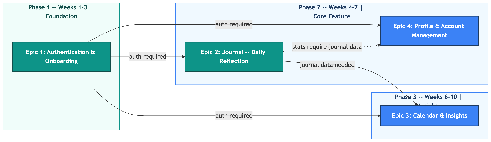
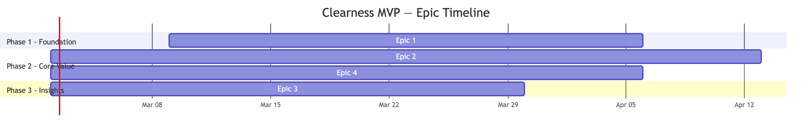

# Clearness MVP Roadmap

**Version:** 1.0
**Date:** March 2, 2026
**Status:** Planning

---

## Epic Summary

| Epic | Title | Priority | Size | Duration | Dependencies | Stories |
|------|-------|----------|------|----------|--------------|---------|
| 01 | Authentication and Onboarding | Must Have | M | 4-6 weeks | None | 11 |
| 02 | Journal: Daily Reflection Chat | Must Have | L | 6-8 weeks | Epic 01 | 12 |
| 03 | Calendar and Mood Insights | Must Have | M | 4-6 weeks | Epic 01, Epic 02 | 10 |
| 04 | Profile and Account Management | Should Have | M | 4-6 weeks | Epic 01, Epic 02 | 12 |

**Total story candidates across all epics:** 45

---

## Sequencing and Phases

### Phase 1: Foundation (Weeks 1-6)

**Epic 01 -- Authentication and Onboarding**

This epic must be completed first. Every other feature in Clearness requires an authenticated user. The user model, OAuth integrations, session management, and route protection form the foundation on which all subsequent epics build. No journal entries can be created, no calendar can be viewed, and no profile can be displayed without knowing who the user is.

### Phase 2: Core Value (Weeks 5-12)

**Epic 02 -- Journal: Daily Reflection Chat**

Work on Epic 02 can begin as soon as the core authentication endpoints and user model from Epic 01 are functional (it does not require Epic 01 to be fully complete -- the sign-in UI can be polished in parallel). The journal is the primary feature of Clearness and the reason users will download and return to the app. It is the largest epic and the most important to get right. The structured chat flow, mood capture, and one-chat-per-day model must be solid before any downstream features can be built.

### Phase 3: Engagement and Completeness (Weeks 10-18)

**Epic 03 -- Calendar and Mood Insights** and **Epic 04 -- Profile and Account Management**

These two epics can be developed in parallel once Epic 02 has shipped enough chat data infrastructure to support them. Epic 03 depends on completed chat records to populate the calendar grid and daily summaries. Epic 04 depends on chat data for journey stats computation.

Between the two, Epic 03 should receive slight scheduling priority because the mood calendar directly reinforces the daily journaling habit by making patterns visible, which supports retention. Epic 04 is a "Should Have" -- it rounds out the app and includes regulatory requirements (account deletion), but its absence would not prevent users from getting core value from the product.

---

## Sequencing Rationale

The sequencing follows three principles from the PRD and standard product development practice:

1. **Foundation first.** Authentication is a hard prerequisite for all features. Attempting to build journals or calendars without a user identity creates rework and security debt.

2. **Value first.** After the foundation, the journal is prioritized because it is the feature that delivers the core value proposition. A user who can sign in and journal is experiencing the product's purpose. A user who can only see a calendar with no entries is not.

3. **Dependency order.** The calendar and profile both consume data produced by the journal. They cannot be meaningfully tested or demonstrated without journal data. Scheduling them after Epic 02 ensures they can be built against real data structures and validated end-to-end.

---

## Overlap Opportunities

While the epics are sequenced, there are opportunities for parallel work:

- **Epic 01 + Epic 02 overlap (Weeks 5-6):** Once the backend auth endpoints are stable, frontend work on the chat UI can begin while Epic 01's sign-in UI is polished.
- **Epic 03 + Epic 04 overlap (Weeks 10-18):** These epics are independent of each other and can be developed by separate team members or streams simultaneously.
- **Backend ahead of frontend:** Within each epic, backend API work can start 1-2 weeks before frontend integration, enabling a pipeline approach.

---

## Out of Scope for MVP (Deferred)

The following items from the PRD are acknowledged but deferred beyond the four MVP epics:

| Item | PRD Reference | Reason for Deferral |
|------|---------------|---------------------|
| End-to-end encryption implementation | Section 5.1 | Complex; MVP will use TLS in transit + encrypted at rest; full E2E requires key management design |
| Local-first / offline support | Section 5.1, 6.2 | Significant architectural complexity; MVP requires internet connection |
| LLM-powered chat responses | Section 6.1 | MVP uses templated responses; LLM integration is a separate initiative |
| Crisis resource links and disclaimers | Section 8 | Important but can be added as a fast-follow after MVP launch |
| Data export / download my data | Section 5.3 (GDPR) | Placeholder included in Epic 04; full implementation deferred |

---

## Dependency Diagram

Source: [clearness-epic-dependency-map.mmd](clearness-epic-dependency-map.mmd)

## Timeline

---

## Success Criteria for MVP Completion

The MVP is considered complete when:

1. A new user can sign in via Google or Apple and land on the Journal screen
2. The user can complete a daily reflection chat with mood capture
3. The user can view their mood history on the Calendar screen and tap into daily summaries
4. The user can see their journey stats on the Profile screen
5. The user can configure a daily reminder
6. The user can delete their account and all data
7. All features work on mobile viewport sizes (375px width and above)
8. Core API endpoints have automated test coverage
